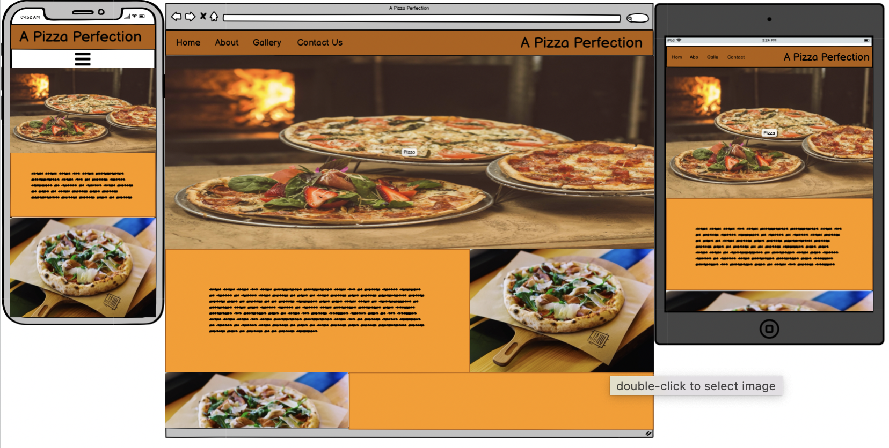

# A Pizza Perfection

A Pizza Perfection is a website which gives the user information on the history of two main types of pizza, these being Neopolitan and Romana. The website will explain the differences between the two allowing the user to choose which they prefer and try them at home.

There will be a section for users to provide feedback and topping inspirational ideas.

## User Stories

- Provide information on Romana and Neopolitan Pizza
- Provide user differences between the two pizzas
- Provide images to inspire the user
- Provide a method of voting for a favourite type of pizza

## Initial Framework

Before starting the website I used a framework design tool called [Balsamic](https://balsamiq.com/) to mockup an initial design idea.

## Features 

### Existing Features

- __Navigation Bar__

  - Featured on all three pages, the full responsive navigation bar includes links to the Logo, Home page, History, Gallery and Contact Us page and is identical in each page to allow for easy navigation.
  - This section will allow the user to easily navigate from page to page across all devices without having to revert back to the previous page via the ‘back’ button. 

  

- __The landing page image__

  - The landing includes a photograph with text overlay to allow the user to see exactly which location this site would be applicable to. 
  - This section introduces the user to A Pizza Perfection

  

- __The Footer__ 

  - The footer section includes links to the relevant social media sites for A Pizza Perfection. The links will open to a new tab to allow easy navigation for the user. 
  - The footer is valuable to the user as it encourages them to keep connected via social media

  

- __History__

  - The history page is valuable to the user as it explains the main difference between the two different types of pizza. 
  - Gives the main criteria for a pizza to be recognised as a Romana or Neopolitan.

- __Gallery__

  - The gallery will provide the user with supporting images to see what different types of pizza users have made. 
  - This section is valuable to the user as it will inspire them to use new toppings and try new flavours.

### Features Left to Implement

- File upload so users can post their own pizza creations
- Add code to allow for a drop down navigation menu when on smaller screens

## Testing 

* ## Manual Testing
    * I conducted a manual check list for myself to carry out to make sure that everything is working as intended.

   * ### Manual Tests Conducted
      * Navigation Menu
        * Verify that clicking on logo navigates to the home page.
        * Verify that when clicked, all navigation links correctly navigate to their respective pages.
        * Verify that all navigation links have the :hover psuedo selector.
        * Verify that the navigation bar is fully responsive.
      * Home/Landing Section
        * Verify that the hero image fits and does not pixelate.
        * Verify that the cover text is displayed correctly.
        * Verify that the paragraph and image are displayed correctly.
        * Verify that the Home/Landing section is fully responsive.
      * History Page
        * Verify that the text is clearly presented with the correct font-style and font-size.
        * Verify that the text does not have any spelling mistakes.
        * Verify that the images are not distorted.
        * Verify that the History is fully responsive.
      * Gallery Page
        * Verify that the gallery images all load.
        * Verify that the gallery images drops to a column count of 2 at less than 480px.
        * Verify that the Gallery is fully responsive.
      * Contact Us Section
        * Verify that all elements that are set to required are working.
        * Verify that valid email address is needed with relevant '@' included.
        * Verify that the text is clearly presented with the correct font-style and font-size.
        * Verify that the text does not have any spelling mistakes.
        * Verify that 'Submit' button informs the user that the submission was successful.
        * Verify that the drop down list shows correct selectors.
        * Verify that the Contact section is fully responsive.
      * Footer Section
        * Verify that the social media links open in a new tab.
        * Verify that the Footer section is fully responsive
          

### Validator Testing 

- HTML
  - 
- CSS
  -
  

## Bugs Fixed

### No Opener
  * Spelt the rel - noopener incorrectly so was flagged on validation and corrected

### Degrees Symbol
  * For both degrees fahrenhiet and degrees celsius the symbol was copied in. When validation this showed as an error. Repleced with HTML code which fixed the issue.

## Deployment

This section should describe the process you went through to deploy the project to a hosting platform (e.g. GitHub) 

- The site was deployed to GitHub pages. The steps to deploy are as follows: 
  - In the GitHub repository, navigate to the Settings tab 
  - From the source section drop-down menu, select the Master Branch
  - Once the master branch has been selected, the page will be automatically refreshed with a detailed ribbon display to indicate the successful deployment. 

The live link can be found here - https://harryrhayden.github.io/CI_PP1/

## Credits 

### Code

- The gallery style code was taken from the Love Running project

### Content 

- The icons in the footer were taken from [Font Awesome](https://fontawesome.com/)
- 

### Media

- The photos used on the site are from [Pexels](https://www.pexels.com/)
- The colours used on the site are found on [Coolors](https://coolors.co/)
- The favicon came from [Favicon](https://favicon.io/)