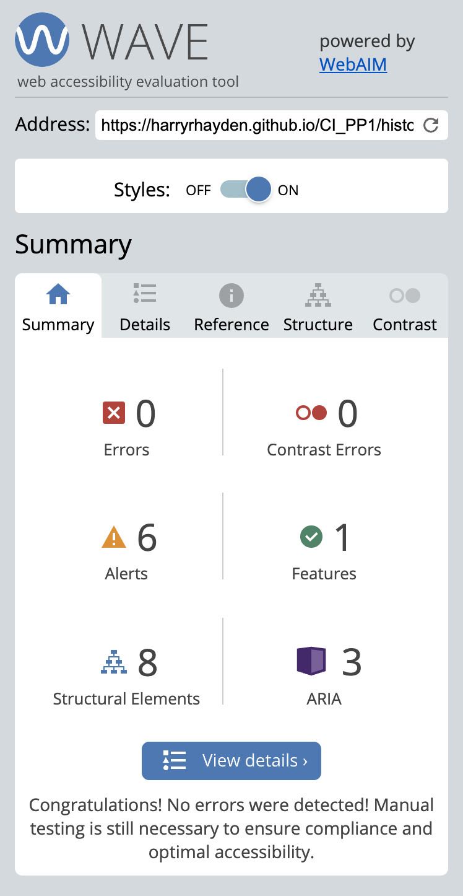

# A Pizza Perfection

A Pizza Perfection is a website which gives the user information on the history of two main types of pizza, these being Neopolitan and Romana. The website will explain the differences between the two allowing the user to choose which they prefer and try them at home.

There will be a section for users to provide feedback and topping inspirational ideas.

[Live Webpage](https://harryrhayden.github.io/CI_PP1/index.html)

1. [Project Goals](#project-goals)
    1. [User Goals](#user-goals)
    2. [Site Owner Goals](#site-owner-goals)
2. [User Experience](#user-experience)
    1. [Target Audience](#target-audience)
    2. [User Requrements and Expectations](#user-requrements-and-expectations)
    3. [User Stories](#user-stories)
3. [Style Choices](#style-choices)
    1. [Design Choices](#design-choices)
    2. [Colour](#colour-scheme)
    4. [Structure](#structure)
    5. [Initial Framework](#initial-framework)
4. [Technologies Used](#technologies-used)
    1. [Languages](#languages)
    2. [Frameworks & Tools](#frameworks-&-tools)
5. [Features](#features)
6. [Testing](#testing)
    1. [Manual Testing](#manual-testing)
    5. [Device testing](#performing-tests-on-various-devices)
    6. [Browser compatibility](#browser-compatability)
    7. [Testing user stories](#testing-user-stories)
7. [Validation](#validator-testing)
    1. [HTML](#html)
    2. [CSS](#css)
    3. [Lighthouse](#lighthouse-score)
    4. [Accessibility](#accessibility)
8. [Bugs Fixed](#bugs-fixed)
9. [Deployment](#deployment)
10. [Credits](#credits)
    1. [Code](#code)
    2. [Content](#content)
    3. [Media](#media)

## Project Goals

### User Goals

1. Provide information on pizza
2. Provide information on the two main types of pizza
3. Provide the user the main differences of the two main types
4. Provide a gallery of images
5. Provide a contact form
6. Conduct a survey on peoples favourite type of pizza
7. Provide a way to navigate around the site
8. Provide links to social networking

### Site Owner Goals

9. To provide a platform to introduce people to Romana and Neopolitan pizza
10. Promote Italian food primarily pizza
11. Promote Italian culture through food

## User Experience

### Target Audience

- People looking into making homemade pizza
- People looking to learn about the origin of pizza
- People looking to understand the difference between a Romana and Neopolitan pizza
- People who enjoy cooking

### User Requrements and Expectations

- A easy to use navigation system
- Information that is relevant and easy to understand
- Functions and links that respond and work as expected
- Presentation and visual aesthetics regardless of screensize
- Accessibility

### User Stories

- Provide information on Romana and Neopolitan Pizza
- Provide user differences between the two pizzas
- Provide images to inspire the user
- Provide a method of voting for a favourite type of pizza

## Style Choices

### Design
The webpage is designed to encourage people to learn about the origin and history of pizza, providing them a detailed account of the two main types. It has incorporated both a pizza feel
and the Italian flag to reflect the culture and background of pizza.

### Colour Scheme

For the colour of the Home page I used [Coolors](https://coolors.co/) which allowed me to utilise the colour of the cheese/dough for a palette.

Colour Palette

 
For the colour scheme of the History page I utilised the hex colours of the Italian flag via [Scheme Colour](https://www.schemecolor.com/italy-flag-colors.php).

Colour Palette

### Structure

### Initial Framework

Before starting the website I used a framework design tool called [Balsamic](https://balsamiq.com/) to mockup an initial design idea.

Index

 

## Technologies Used

### Languages
- HTML
- CSS

### Frameworks & Tools
- Bootstrap v5.0
- Git
- GitHub
- Gitpod
- Compressor.io
- Paint.NET
- Balsamiq
- Google Fonts
- Coolors
- Font Awesome
- Favicon.io

## Features
### Existing Features

- __Navigation Bar__

  - Featured on all three pages, the full responsive navigation bar includes links to the Logo, Home page, History, Gallery and Contact Us page and is identical in each page to allow for easy navigation.
  - This section will allow the user to easily navigate from page to page across all devices without having to revert back to the previous page via the ‘back’ button. 
  - User stories covered : 1

  

- __The landing page image__

  - The landing includes a photograph with text overlay to allow the user to see exactly which location this site would be applicable to. 
  - This section introduces the user to A Pizza Perfection
  - User stories covered : 1, 2

  

- __The Footer__ 

  - The footer section includes links to the relevant social media sites for A Pizza Perfection. The links will open to a new tab to allow easy navigation for the user. 
  - The footer is valuable to the user as it encourages them to keep connected via social media
  - User stories covered : 8

  

- __History__

  - The history page is valuable to the user as it explains the main difference between the two different types of pizza. 
  - Gives the main criteria for a pizza to be recognised as a Romana or Neopolitan.
  - User stories covered : 1, 2, 3, 7

  

- __Gallery__

  - The gallery will provide the user with supporting images to see what different types of pizza users have made. 
  - This section is valuable to the user as it will inspire them to use new toppings and try new flavours.
  - User stories covered : 4, 7

  

- __Contact Us__

  - The history page is valuable to the user as it explains the main difference between the two different types of pizza. 
  - Gives the main criteria for a pizza to be recognised as a Romana or Neopolitan.
  - User stories covered : 5, 6

  

- __404 Error Page__

  - This gives a custom 404 error page so the user can return to the page they were looking for

  

### Features Left to Implement

- File upload so users can post their own pizza creations
- Add code to allow for a drop down navigation menu when on smaller screens

## Testing 

* ## Manual Testing
    * I planned and carried out the below manual tests for the pages.

   * ### Manual Tests Conducted
      * Navigation Menu
        * Ensure that when the header is clicked it returns to the home page
        * Ensure that all navigation links correctly navigate to their respective pages when clicked
        * Ensure that all the :hover psuedo selectors work when using the navigation bar
        * Ensure the responsiveness of the navigation bar
      * Home/Landing Section
        * Ensure the hero image is not distorted
        * Ensure that the cover text is displayed correctly
        * Ensure that the paragraph and image are displayed correctly
        * Ensure the responsiveness of the page
        * Ensure that the font-style and size are visible and of good contrast
      * History Page
        * Ensure that the font-style and size are visible and of good contrast
        * Ensure that there are no spelling mistakes
        * Ensure that the images are not distorted
        * Ensure the responsiveness of the page
      * Gallery Page
        * Ensure that the gallery images all load
        * Ensure that the gallery images drops to a column count of 2 at less than 480px
        * Ensure the responsiveness of the page
      * Contact Us Section
        * Ensure that all required elements work
        * Ensure that the '@' symbol is required in the email address section
        * Ensure that the font-style and size are visible and of good contrast
        * Ensure that there are no spelling mistakes
        * Ensure that 'Submit' button provides an informational pop-up
        * Ensure that the drop down list shows correct selectors
        * Ensure the responsiveness of the page
      * Footer Section
        * Ensure that when you select a social media link it opens in a new tab
        * Ensure the responsiveness of the Footer

## Validator Testing 

### HTML
Validation completed by [Free Formatter](https://www.freeformatter.com/html-validator.html) this was due to W3S website being down for multiple days and not available to use. This validator returned no errors for HTML.

  

Index Page

  

History Page

  

Gallery Page

  

Contact Us Page

### CSS

Validation for CSS coding was completed by [W3S CSS Validator](https://jigsaw.w3.org/css-validator/) and returned no errors for my CSS coding.

  

CSS

  
### Lighthouse Score

Lighthouse score was provided by Chrome Dev Tools and all scores were returned above 92.

Lighthouse Index

Lighthouse History

Lighthouse Gallery

Lighthouse Contact

### Accessibility

Accessibility was tested using [Wave Webaim](https://wave.webaim.org/) and returned no errors.

Accessibility Index

Accessibility History

Accessibility Gallery

Accessibility Contact

## Bugs Fixed

### No Opener
  * Spelt the rel - noopener incorrectly so was flagged on validation and corrected

  

No opener

### Degrees Symbol
  * For both degrees fahrenhiet and degrees celsius the symbol was copied in. When validation this showed as an error. Replaced with HTML code which fixed the issue.

  

Degrees

## Deployment

The website was deployed using GitHub Pages by following these steps:
1. On the GitHub repository select the Settings tab
2. Using the left hand sub-menu select Pages
3. When asked for the source select Branch: master
4. After the webpage refreshes automaticaly you will be shown a ribbon along the top saying: "Your site is published at https://4n4ru.github.io/CI_MS1_BodelschwingherHof/"

You can for fork the repository by following these steps:
1. Go to the GitHub repository
2. Click on Fork button in upper right hand corner

You can clone the repository by following these steps:
1. Go to the GitHub repository 
2. Locate the Code button above the list of files and click it 
3. Select if you prefere to clone using HTTPS, SSH, or Github CLI and click the copy button to copy the URL to your clipboard
4. Open Git Bash
5. Change the current working directory to the one where you want the cloned directory
6. Type git clone and paste the URL from the clipboard ($ git clone https://github.com/YOUR-USERNAME/YOUR-REPOSITORY)
7. Press Enter to create your local clone.

The live link can be found here - https://harryrhayden.github.io/CI_PP1/

## Credits 

### Code

- The gallery style code was taken from the Love Running project
- The Google Maps code was generated by [Google Map](https://google-map-generator.com/)

### Content 

- The icons in the footer were taken from [Font Awesome](https://fontawesome.com/)
- The images were compressed using [Compressor IO](https://compressor.io/)

### Media

- The photos used on the site are from [Pexels](https://www.pexels.com/)
- The colours used on the site are found on [Coolors](https://coolors.co/) and [Scheme Colour](https://www.schemecolor.com/italy-flag-colors.php)
- The favicon came from [Favicon](https://favicon.io/)