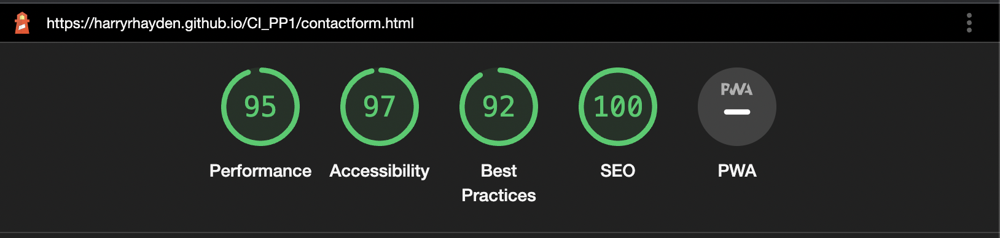

# A Pizza Perfection

A Pizza Perfection is a website which gives the user information on the history of two main types of pizza, these being Neopolitan and Romana. The website will explain the differences between the two allowing the user to choose which they prefer and try them at home.

There will be a section for users to provide feedback and topping inspirational ideas.

[Live Webpage](https://harryrhayden.github.io/CI_PP1/index.html)

## User Stories

- Provide information on Romana and Neopolitan Pizza
- Provide user differences between the two pizzas
- Provide images to inspire the user
- Provide a method of voting for a favourite type of pizza

## User Goals

1. Provide information on pizza
2. Provide information on the two main types of pizza
3. Provide the user the main differences of the two main types
4. Provide a gallery of images
5. Provide a contact form
6. Conduct a survey on peoples favourite type of pizza
7. Provide a way to navigate around the site
8. Provide links to social networking

## Initial Framework

Before starting the website I used a framework design tool called [Balsamic](https://balsamiq.com/) to mockup an initial design idea.

Initial Framework

## Style Choices

### Colour Scheme

For the colour of the Home page I used [Coolors](https://coolors.co/) which allowed me to utilise the colour of the cheese/dough for a palette.

Colour Palette

 
For the colour scheme of the History page I utilised the hex colours of the Italian flag via [Scheme Colour](https://www.schemecolor.com/italy-flag-colors.php).

Colour Palette

 

## Features
### Existing Features

- __Navigation Bar__

  - Featured on all three pages, the full responsive navigation bar includes links to the Logo, Home page, History, Gallery and Contact Us page and is identical in each page to allow for easy navigation.
  - This section will allow the user to easily navigate from page to page across all devices without having to revert back to the previous page via the ‘back’ button. 
  - User stories covered : 1

  

- __The landing page image__

  - The landing includes a photograph with text overlay to allow the user to see exactly which location this site would be applicable to. 
  - This section introduces the user to A Pizza Perfection
  - User stories covered : 1, 2

  

- __The Footer__ 

  - The footer section includes links to the relevant social media sites for A Pizza Perfection. The links will open to a new tab to allow easy navigation for the user. 
  - The footer is valuable to the user as it encourages them to keep connected via social media
  - User stories covered : 8

  

- __History__

  - The history page is valuable to the user as it explains the main difference between the two different types of pizza. 
  - Gives the main criteria for a pizza to be recognised as a Romana or Neopolitan.
  - User stories covered : 1, 2, 3, 7

  

- __Gallery__

  - The gallery will provide the user with supporting images to see what different types of pizza users have made. 
  - This section is valuable to the user as it will inspire them to use new toppings and try new flavours.
  - User stories covered : 4, 7

  

- __Contact Us__

  - The history page is valuable to the user as it explains the main difference between the two different types of pizza. 
  - Gives the main criteria for a pizza to be recognised as a Romana or Neopolitan.
  - User stories covered : 5, 6

  

### Features Left to Implement

- File upload so users can post their own pizza creations
- Add code to allow for a drop down navigation menu when on smaller screens

## Testing 

* ## Manual Testing
    * I planned and carried out the below manual tests for the pages.

   * ### Manual Tests Conducted
      * Navigation Menu
        * Ensure that when the header is clicked it returns to the home page
        * Ensure that all navigation links correctly navigate to their respective pages when clicked
        * Ensure that all the :hover psuedo selectors work when using the navigation bar
        * Ensure the responsiveness of the navigation bar
      * Home/Landing Section
        * Ensure the hero image is not distorted
        * Ensure that the cover text is displayed correctly
        * Ensure that the paragraph and image are displayed correctly
        * Ensure the responsiveness of the page
        * Ensure that the font-style and size are visible and of good contrast
      * History Page
        * Ensure that the font-style and size are visible and of good contrast
        * Ensure that there are no spelling mistakes
        * Ensure that the images are not distorted
        * Ensure the responsiveness of the page
      * Gallery Page
        * Ensure that the gallery images all load
        * Ensure that the gallery images drops to a column count of 2 at less than 480px
        * Ensure the responsiveness of the page
      * Contact Us Section
        * Ensure that all required elements work
        * Ensure that the '@' symbol is required in the email address section
        * Ensure that the font-style and size are visible and of good contrast
        * Ensure that there are no spelling mistakes
        * Ensure that 'Submit' button provides an informational pop-up
        * Ensure that the drop down list shows correct selectors
        * Ensure the responsiveness of the page
      * Footer Section
        * Ensure that when you select a social media link it opens in a new tab
        * Ensure the responsiveness of the Footer

### Lighthouse Score

Lighthouse Index

Lighthouse History

Lighthouse Gallery

Lighthouse Contact

## Validator Testing 

Validation completed by [Free Formatter](https://www.freeformatter.com/html-validator.html)

### HTML

  

Index Page

  

History Page

  

Gallery Page

  

Contact Us Page

### CSS

  

CSS

  

## Bugs Fixed

### No Opener
  * Spelt the rel - noopener incorrectly so was flagged on validation and corrected

  

No opener

### Degrees Symbol
  * For both degrees fahrenhiet and degrees celsius the symbol was copied in. When validation this showed as an error. Replaced with HTML code which fixed the issue.

  

Degrees

## Deployment

To deploy the site to a hosting platform (such as Github) you are required to follow the steps shown below. 

- The site was deployed on GitHub pages. The flow to deploy is shown below: 
  - In the repository on Github, enter  the Settings tab 
  - Select the Master Branch from the source section drop-down menu 
  - After you select master branch, the page will be refreshed with a detailed ribbon display to show the user the successful deployment of their page. 

The live link can be found here - https://harryrhayden.github.io/CI_PP1/

## Credits 

### Code

- The gallery style code was taken from the Love Running project
- The Google Maps code was generated by [Google Map](https://google-map-generator.com/)

### Content 

- The icons in the footer were taken from [Font Awesome](https://fontawesome.com/)

### Media

- The photos used on the site are from [Pexels](https://www.pexels.com/)
- The colours used on the site are found on [Coolors](https://coolors.co/) and [Scheme Colour](https://www.schemecolor.com/italy-flag-colors.php)
- The favicon came from [Favicon](https://favicon.io/)